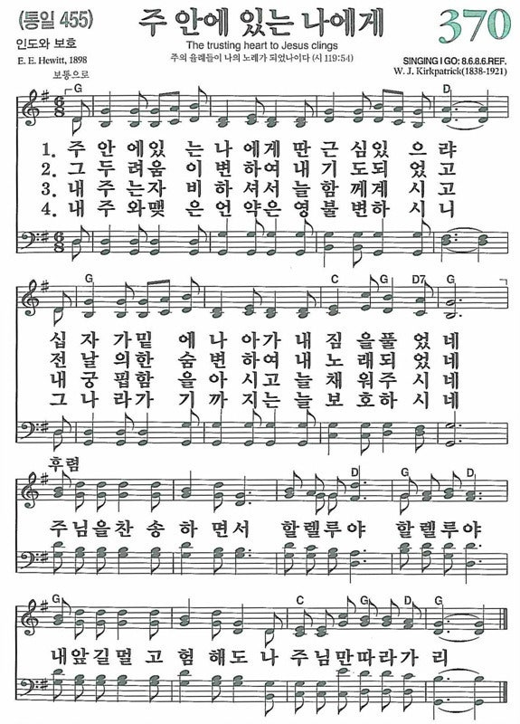

# 084 10-9 크리스챤의 현실 2



> * 마태복음 10:16 보라 내가 너희를 보냄이 양을 이리 가운데 보냄과 같도다 그러므로 너희는 뱀 같이 지혜롭고 비둘기 같이 순결하라
> * 10:17 사람들을 삼가라 저희가 너희를 공회에 넘겨 주겠고 저희 회당에서 채찍질 하리라
> * 10:18 또 너희가 나를 인하여 총독들과 임금들 앞에 끌려 가리니 이는 저희와 이방인들에게 증거가 되게 하려 하심이라
> * 10:19 너희를 넘겨줄 때에 어떻게 또는 무엇을 말할까 염려치 말라 그 때에 무슨 말할 것을 주시리니
> * 10:20 말하는 이는 너희가 아니라 너희 속에서 말씀하시는 자 곧 너희 아버지의 성령이시니라
> * 10:21 장차 형제가 형제를, 아비가 자식을 죽는데 내어주며 자식들이 부모를 대적하여 죽게 하리라
> * 10:22 또 너희가 내 이름을 인하여 모든 사람에게 미움을 받을 것이나 나중까지 견디는 자는 구원을 얻으리라
> * 10:23 이 동네에서 너희를 핍박하거든 저 동네로 피하라 내가 진실로 너희에게 이르노니 이스라엘의 모든 동네를 다 다니지 못하여서 인자가 오리라

\

우리는 지난주에 예수님께서 제자들을 세상에 보내시면서, 제자들이 당면한 현실과 세상의 본질에 대해서 예수님이 말씀하시는 것을 들었습니다.

첫째는 이 세상이라고 하는 것은, 예수님에 의하면, 결코 아름다운 환상의 유토피아가 아니다 라고 하는 사실입니다. 세상은 아름답게 보입니다. 물댄동산 같고 에덴동산처럼 멋있어 보입니다. 그러나 세상은 결코 멋있는 곳이 아니다. 굶주린 이리떼들이 득실거리는 것이 바로 세상의 본질이다. 예수님은 세상에 악한 것을 아시고 도피하신 것이 아닙니다. 그 악한 세상, 이리떼들이 득실거리고 있는 그 세상 속에 예수님은 뛰어 들어가셔서 십자가에 못박혀 죽으셨습니다.

여러분 우리들이 알아야 되는 것은 인간의 본질을 알아야 됩니다. 여기 다, 다 그럴듯하게 다 점잖게 앉아 있지만, 다 우리들 속에는 더럽습니다. 음란하고 부정적이고 탐욕이 많고 못된 생각들을 하는 것이 인간입니다. 넥타이 매고 다 이렇게 화장하고 파마해봐야 소용이 없습니다. 인간은 더럽다는 사실을 우리는 알아야 합니다. 세상은 본질이 악하다는 사실을 우리는 이해해야 합니다.

예수님이 그렇게 말씀하셨습니다. 예수님이 제자들을 세상에 보내는 심정은 마치 양을 이리 속에 보내는 것과 같다고 설명을 하셨습니다. 그것이 하나님의 심정입니다. 그것이 모든 그리스도인의 심정입니다. 그리스도인들은 이 악한 세상에서 살면서 이 심정을 가지고 사는 것입니다. 양을 이리 때에 보내는 심정을 가지고 사는 사람들이 바로 그리스도인들입니다.

예수님은 또 한 가지를 말씀하셨습니다. 이 악한 세상에, 악한 인간들이 살고 있는, 이 양의 가죽을 쓴 이리들이 살고 있는, 이 세상에서 그리스도인이 살아야 하는 원칙이 있다.

첫째는 지혜다. 절대 미련하게 살지 말아라. 지혜롭게 살아라. 지혜는 뱀에서 배워라. 뱀은 악한 동물입니다. 그런데 예수님은 그 뱀에서 지혜를 배우라고 말했습니다. 그렇습니다. 그리스도인은 지혜롭게 살아야 합니다.

또 한 가지가 있습니다. 지혜는 간교가 한 것이 아니다. 지혜는 교활한 것이 아니다. 지혜 속에는 순수한 순결이 있어야 한다. 예수님은 우리들에게 비둘기가 주는 그 모습 속에서 순결함을 배워라. 그래서 이 세상에서 살아가는 크리스천의 두 가지 원리는 순결과 지혜였습니다.

\

오늘 본문에서는 예수님께서 또 한 가지, 이 악한 세상에서, 악한 사람들이 살고 있는 이 세상 속에서, 그리스도인들이 어떻게 살아가야 하느냐는 원리를 17절에서 새로운 것을 또 말씀해 주십니다. 17절을 같이 보시겠습니다. 시작. 사람들을 삼가라. 저희가 너희를 공회에 넘겨 주겠고, 저희 회당에서 채찍질 하리라.

> * 마태복음 10:17 사람들을 삼가라 저희가 너희를 공회에 넘겨 주겠고 저희 회당에서 채찍질 하리라

\

예수님은 우리들에게 사람 조심 하라는 것입니다. 어떤 유명한 연극, 일본 연극인데, 그 연극에 이런 대사가 있습니다. 무덤인데 비 오는 캄캄한 밤에, 아주 음산한 그 밤에, 칠흙같은 밤에, 그 무덤의 무덤지기가 있습니다. 무덤지기가 무덤을 돌보는데 갑자기 어떤 사람이 나타납니다. 이 주인공이 나타나서 무덤에 가는데 그 문지기를 보고 깜짝 놀랍니다. 이 캄캄한데 당신이 여기 웬일이냐고 그랬더니, 그래서 둘이 만났습니다. 그랬더니 왜 이렇게 무서워하느냐고, 그랬더니, 아니 그러면 이 비 오는 캄캄한 무덤 밤에 무섭지 않을 수가 있겠느냐고 그랬더니, 이 사람이 이런 얘기를 합니다. 죽은 사람은 무섭지 않습니다. 산 사람이 무섭습니다. 아주 유명한 대사를 합니다.

그렇습니다. 살아있는 사람이 문제가 있습니다. 예수님은 우리들에게 사람들을 조심하라고 이렇게 경고를 하십니다. 여기 있는 사람들은, 모든 사람을 다 조심하라는 뜻은 아닙니다. 악한 사람, 이리떼 같은 사람, 양의 모습을 한 이리 때와 같은 사탄의 종들, 사탄의 세력들을 대표하는, 이런 사람들에 대해서 조심하라고 말합니다.

\

그런데 여기서 한 가지 더 생각할 것이 있습니다. 예수님은 사람들을 조심하라고 그랬지 투쟁하라고 그러지 않았습니다. 경계하라 조심하라 지혜롭게 대처하라 이렇게 말씀을 하셨습니다. 네 가지 종류의 사람에 대해서, 너희들이 세상에 살 때, 특별히 조심을 하고 그들에 대해서 지혜롭게 대처하라고 말씀하십니다.

\

그 네 가지 영역은 첫째는 종교적 그룹에 속한 지도자들입니다. 17절을 다시 보시겠습니다. 사람들을 삼가라. 그다음에, 저희가 너희를 공회에 넘겨주겠고 저희 회당에서 채찍질 하리라.

> * 마태복음 10:17 사람들을 삼가라 저희가 너희를 공회에 넘겨 주겠고 저희 회당에서 채찍질 하리라

\

여기서 저희는 누구를 가리키겠습니까? 바로 종교 지도자들입니다. 이 세상에서 가장 무서운 사탄의 세력은 잘못된 신학과 신앙을 가진 사람들입니다. 가장 무서운 적은 교회 밖에 있는 것이 아니라 교회 안에 있습니다.

여러분 진짜 경계해야 할 대상은 타인이 아니라, 자기 자신, 언제나 자기 자신 안에 무서운 반신적이고 비신앙적인 세력이 자기 안에 있다는 것입니다. 다른 사람의 문제가 아닙니다. 내 문제입니다. 교회 밖의 문제가 아닙니다. 교회 안의 문제입니다.

극단적인 이단들이 바로 이런 세력들입니다. 최근에 30여명의 주부들이 집단 가출한 이단 사건이 신문에 크게 난 일이 있습니다. 통일교는 이러한 극단 이단 사상의 대표적인 세력입니다. 이러한 사람들은 사람들을 지옥으로 끌고 가는 악한 종교적인 무리들입니다. 차라리 기독교와 다르다면 쉽게 발견할 수 있습니다. 그러나 그들이 성경의 이름으로 하나님의 이름으로, 기독교의 이름으로 기생해서 사람들의 영혼을 착취해 갑니다.

또 한 가지 그룹이 있습니다. 성경을 자기 편한 대로 해석해서 잘못된 신앙을 갖는 전통주의자들과 자유주의자들입니다. 여러분 극단적인 신비주의 이것은 비성경적인 것입니다. 극단적인 보수 전통주의 이것도 잘못된 것입니다. 반대로 극단적인 자유주의자 이것도 잘못된 것입니다. 결국 그들은 신앙의 이름으로 사람을 노예화시키고, 신앙의 이름으로 사람을 착취하는 것입니다. 그래서 공산주의자들은 종교를 아편이로 까지 조소했던 것입니다. 이것은 잘못된 신앙의 모델을 두고 우리가 생각해 볼 수가 있습니다.

예수님 당시에도 이런 잘못된 신앙 지도자들이 있었습니다. 서기관과 바리새인들과 사두개인들의 무리였습니다. 그들은 하나님을 독점한 사람들이었습니다. 그들은 종교를 독점한 사람들이었습니다. 그러나 가장 반신적이었고 예수님과 정반대의 위치에 있었던 사람들이었습니다. 종교가 저지른 큰 죄악들이었습니다. 바리새인들은 전통주의자들을 대표한다면, 사두개인은 자유주의자들을 대표하는 것입니다. 그들은 정의의 이름으로 진리를 죽였습니다.

요즘도 정의라는 이름을 가진 단체를 늘 조심해야 됩니다. 히긴스 중령을 죽인 그 극단의 그 그룹도 다 정의라는 이름을 가진 집단입니다. 하나님의 정의를 그들은 인간의 정의를 하나님의 정의처럼 사용하고 있는 것입니다. 정의는 하나님에게만 있는 것이지 인간에게는 없는 것입니다. 하나님만이 참 정의이십니다. 그러나 인간은 하나님의 정의를 인간의 정의로 바꾸어 버립니다. 그들은 진리의 이름으로, 정의의 이름으로 예수를 죽였던 것입니다. 시기와 질투, 모함과 살인 재판을 한 장본인들이 누구였습니까? 다른 사람이 아니었습니다. 종교 지도자들이었습니다. 그래서 예수님은 이런 사람들을 조심하라, 이런 사람들을 삼가라 라고 말하고 있습니다.

돌이켜보면 2천년의 기독교 역사 가운데서 이러한 일들이 참 허다했던 것을 봅니다. 종교가 주었던 좋은 점도 있었지만, 종교가 주었던 인간에 대한 얼마나 큰 피해가 있었는지 말할 수가 없습니다. 특별히 루터와 칼빈의 종교개혁 당시에 캐톨릭의 상황을 보면 그 예를 우리가 얼마든지 찾아볼 수가 있었습니다. 천국을 돈과 바꿨습니다. 성직을 매매했습니다. 종교적인 이름으로 많은 사람들을 영적으로 그들은 결박을 하고 괴로움을 주고 고통을 주었던 것입니다. 어떤 의미에서 가장 반신적이고 불법을 행하는 자들이 오히려 교회 안에 있는 지도자일지도 모릅니다.

세상에서 가장 잔인하고 무서운 재판은 종교 재판입니다. 종교 재판이 주었던 그 피해를 우리는 잘 알고 있습니다. 나쁜 인간들이 종교의 이름으로 하나님의 이름으로, 신앙의 이름으로 신의 대리인의 역할을 그들이 잘못한 것입니다. 그래서 성경은 잘못된 종교 지도자들에 대해서 조심하라 삼가라 라고 이야기를 합니다.

\

두 번째 그룹이 있습니다. 두 번째 그룹은 정치적인 그룹 속에 우리가 조심해야 할 대상이 있다고 말합니다. 18절을 보시기를 바랍니다. 같이 읽겠습니다. 시작. 또 너희가 나를 인하여 총독들과 임금들 앞에 끌려 가리니, 이는 저희와 이방인들에게 증거가 되게 하려 하심이라.

> * 마태복음 10:18 또 너희가 나를 인하여 총독들과 임금들 앞에 끌려 가리니 이는 저희와 이방인들에게 증거가 되게 하려 하심이라

\

여기 보면, 총독들과 임금들 앞에 크리스천들이 끌려간다는 말씀을 하고 있습니다. 이 임금들과 총독들은 정치 세력을 의미합니다. 사실 잘못된 정치와 잘못된 정치가들 때문에 얼마나 선량한 많은 사람들이 고통을 당하고 핍박을 받습니까?

세상 정치란 무엇입니까? 세상 정치란 백성들을 바르게 다스리기보다는 그들이 권력을 행사하는 조직으로 이 정치를 이용하는 것입니다. 이 세상 정치에는 이러한 속성이 있습니다. 그래서 이 세속적이고 잘못된 정치 구조 속에는, 수많은 사람들이 죽음을 당하고 가족이 이산되고 평생 불행하게 살며 조국을 잃어버리고 타향살이를 하게 하는 것입니다.

참된 정치는 사람의 정치가 아닙니다. 참된 정치는 구약에 보면 하나님의 정치입니다. 여러분 구약에 보면 하나님이 인간에게 왕 제도를 주기를 원치 않았습니다. 왜냐하면 정치는 하나님으로부터 와야 했기 때문입니다. 그러나 인간들은 자꾸 우리들이 스스로 정치하겠다고 말했습니다. 왕을 달라고 말했습니다. 그것이 다윗 왕이 생기게 된 동기였습니다.

그러나 인간이 왕을 만들고 나서부터는, 계속해서 피비린내 나는 쿠테타와 살인과 죽음과 정변이 계속 일어났던 것입니다. 그것이 인간의 정치입니다. 죄인인 인간이 하는 정치는 역시 죄일 수밖에 없고 악일 수밖에 없습니다. 크리스천들은 세상의 총독과 임금들 앞에 끌려서 고난을 당하고 순교를 당하게 될 것이라고 예수님은 오늘 본문에서 말씀하고 있습니다.

로마 당시에 네로를 생각을 해보십시오. 그들은 얼마나 많은 크리스천들을 죽였습니까? 사자를 통해서 죽였고, 화형을 시켜서 죽였고, 말할 수 없는 핍박을 했던 것입니다.

그런데 놀라운 사실은 예수님께서는 이러한 고난 속에 이러한 정치적인 어려움 속에서도 한 번도 정치적인 발언을 하지 않았다는 데 예수님의 독특성이 있습니다. 예수님은 한 번도 정치적인 발언을 한 일이 없었습니다. 그러나 예수님은 정치를 완전히 정복하신 분이셨습니다.

\

이제 예수님께서는 이렇게 말씀하시고 한 걸음을 더 나아갑니다. 만약에 크리스천들이, 예수님의 제자들이, 정치적인 수난과 고난을 겪을 때 어떻게 해야 하는가 하는 문제를 예수님이 질문하면서 두 가지로 대답을 해 주십니다. 18절 하반절을 보시겠습니다. 또 너희가 나를 인하여 총독과 임금들 앞에 끌려가게 될 텐데, 가리니 이는 저희와 이방인들에게 증거가 되게 하려 함이라.

> * 마태복음 10:18 또 너희가 나를 인하여 총독들과 임금들 앞에 끌려 가리니 이는 저희와 이방인들에게 증거가 되게 하려 하심이라

\

첫째, 정치적 학대는 복음 전도의 의미가 있습니다. 하나님께서는 크리스찬들이 특별히 정치적 수난을 당할 경우에, 그것은 단순한 정치적 고통이라고 하는, 수난이라고 하는 의미가 있는 것이 아니다. 전도하기 위한 하나님의 방법이다. 이렇게 말씀하십니다. 너희들이 총독과 임금들 앞에 끌려가게 될 것이다. 그것은 정치적인 동기와 이유 때문일 것이다. 그 사람들이 권력을 유지하기 위하여, 그 사람들이 크리스천들을 박해하기 위하여, 그 사람들의 어떤 불순한 동기 때문에, 당리당략을 인해서 너를 잡아가고 고통을 줄지도 모른다.

비록 그런 동기로 너를 고통 주었다 할지라도 너는 정치적 투쟁을 하지 말라. 너는 그것을 복음 전도의 기회로 삼아라. 총독과 임금들에게 그리고 이방인들에게 복음을 증거하는 기회로 삼아라. 예수님께서 이렇게 말씀하여 주신 것입니다.

구약에서 두 사람의 예를 들어보겠습니다. 요셉입니다. 요셉은 착한 사람입니다. 하나님을 정말 잘 섬기는 사람이고 그의 정직은 수난을 가져왔습니다. 감옥에 들어갔습니다. 한 여인의 탐욕 때문에 그 요셉은 감옥에 들어간 것입니다. 그런 정치적인 위기 속에서 그는 모함을 당했던 것입니다. 그러나 그가 하나님을 잘 섬김으로 결과적으로 그는 총리 대신이 되었습니다. 자 물어보겠습니다. 요셉은 정치가입니까? 신앙가입니까? 신앙인입니다. 그가 참된 신앙을 가지고 있었더니 정치적 위치에까지 가게 됐다는 것입니다.

또 한 사람의 예를 들어보십시다. 다니엘입니다. 다니엘은 왕의 총애를 받았던 사람이었습니다. 큰 총애를 받았던 사람입니다. 그러나 그는 정치적인 야망을 가진 젊은이들이 아니었습니다. 그들은 생명을 걸고 하나님을 섬겼던 사람들이었습니다. 결국 그들은 정치적인 모함을 받아서 불 속에 들어갑니다. 그리고 굶주린 사자 속에 들어갑니다. 그러나 다니엘은 머리털 하나 상하지 아니하고 사자들도 그를 잡아먹지 못하는 그런 기적을 그들이 보게 된 것입니다. 다니엘은 정치인입니까? 신앙인입니까? 다니엘이나 요셉은 정치적인 고난과 수난의 희생물이었습니다. 희생양이었습니다. 그러나 그들은 신앙을 가지고 있었기 때문에 이러한 위기 속에서 오히려 하나님께 영광을 돌리고 그 이방 세계 속에서 그들은 하나님을 찬양하게 되고 하나님을 높이는 결과를 가져오게 된 것입니다. 그렇습니다. 바로 이것이 크리스천의 모습입니다.

6.25가 났을 때, 복음 때문에 이남으로 피난 오지 않은 성직자들이 많이 있었다고 합니다. 우리 한국교회 존경을 받는 한경직 목사님 같으신 분은 제가 개인적으로 그런 얘기를 들었습니다. 내가 이남에 피난 올 줄 알았더라면 나는 안 왔네. 잠깐 몸을 피신한 게 이남으로 그냥 오고 말았다고, 그런 얘기를 합니다. 이북에 그냥 남아있고 싶었던 것이 본인의 심정이었다고, 그러나 일단 건너와 보니 다시 돌아갈 수 없게 된 게 오늘의 세월에 이르렀다고 말을 했습니다. 그래서 세운 것이 영락교회 라고 말을 합니다.

그렇습니다. 저희 가정도 이북에서 피난 나온 가정입니다. 교회를 지키기 위하여, 성도들을 돌보기 위하여, 이북에서 피난 나오지 않는 성직자들이 있고, 6.25 때 1200명의 목사님들이 순교를 당한 이유도 거기에 있습니다.

크리스찬들은 정치적인 고난을 겪을 때, 정치적인 격변을 당할 때, 우리들은 분명히 목표를 알아야 합니다. 정치 투쟁을 하기 위해 존재하는 것이 아닙니다. 우리들은 복음을 전하기 위하여, 그 정치적 핍박과 고난을 이용하는 사람들입니다. 오늘 오후에 오셔서 설교하게 될 우리 고우석 목사님도 생각해 보면 그런 분 중에 한 분입니다. 8년 전에 언론 통폐합 때문에 하루아침에 MBC에서 그 자리를 쫓겨났습니다. 그 이유를 잘 알지를 못합니다. 몹시 고민하고 몹시 방황을 했습니다. 그러나 그것이 그분으로 하여금 목사가 되게 할 줄을 누가 알았겠습니까? 정치적인 순환이 복음의 증거로 이용된 케이스입니다.

그러므로 정치적인 보복과 정치적인 고난과 정치적인 순환에는 절대로 한을 품어서는 안 됩니다. 거기에 대항해서도 안 됩니다. 그럴 필요가 없는 것입니다. 역사는 사람이 움직이는 것이 아니라 하나님이 움직이기 때문에, 우리는 모든 것을 전도라고 하는 측면에서 해석을 하는 것입니다. 사업이 잘 돼도 전도요. 내가 사업이 안 돼도 전도요. 직장에서 쫓겨날 때 할렐루야를 하세요. 왜? 직장에 있으면 전도도 별로 못했는데, 쫓겨나면 성경도 읽을 수 있고 얼마나 좋은지 모릅니다. 건강 관리도 할 수 있고. 다 모든 것을 이렇게 생각하는 것입니다. 세상이 나를 관리하는 것이 아닙니다. 세상이 나를 부자로 만드는 것도 아니고, 세상이 나를 지위를 주는 것도 아닙니다. 높은 자리에 있을 때 그러므로 교만하지 않고, 낮은 자리에 있을 때 좌절하지 않는 것입니다. 그것이 크리스천입니다.

어떤 자리에 있든지, 내가 은퇴를 했든지, 내가 직장에서 그만뒀었든지, 내가 성공을 했든지 그런 것은 중요한 게 아닙니다. 내가 좋은 자리에, 좋은 학교에 들어갔든지 안 들어갔든지, 이러는 것은 중요한 것이 아닙니다. 복음 전도의 기회로 삼는 것입니다. 살아도 주를 위하여, 죽어도 주를 위하여, 잘 돼도 주를 위하여, 못 돼도 주를 위하여, 병 들어도 주를 위하여, 건강해도 주를 위하여.

\

두 번째, 예수님께서는 너희들이 세상에 살 때, 핍박과 정치적인 고난을 겪을 때, 어떻게 해야 되느냐. 한마디로 말해서 예수님은 세속적인 방법을 쓰지 말라. 이렇게 말씀을 합니다. 성경을 좀 보시겠습니다. 19절입니다. 읽어주십시오. 시작. 너희를 넘겨줄 때 어떻게 또는 무엇을 말할까 염려치 말라. 그때 무슨 말을 할 것을 주시리니 말하는 이는 너희가 아니라 너희 속에서 말씀하시는 자 곧 너희 아버지의 성령이시니라. 아멘. 할렐루야.

> * 마태복음 10:19 너희를 넘겨줄 때에 어떻게 또는 무엇을 말할까 염려치 말라 그 때에 무슨 말할 것을 주시리니
> * 10:20 말하는 이는 너희가 아니라 너희 속에서 말씀하시는 자 곧 너희 아버지의 성령이시니라

\

예수님은 우리들에게, 너희들이 정치적인 억울함, 누명을 쓰게 될 것이다. 감옥에 들어가게 될 것이다. 세상적인 고난을 겪게 될 것이다. 그때 이것을 정치적인 방법으로 대응하지 말라. 이걸 전도의 기회로 삼아라.

두 번째는 거기 가서 네가 그럼 어떻게 할 거냐? 감옥에서 빠져나오게 돈 쓰지 말라 그 말이에요. 사람 동원하지 말라 그 말이에요. 인위적인 방법으로 하지 말라. 그런 방법으로 해서 내가 빠져나왔다면 넌 또 들어가게 될 것이다 이거에요. 그건 세상의 방법이기 때문이에요. 순간이 행복인 것 같지만 영원히 행복은 아니다. 그 말입니다. 하나님이 궁극적으로 하게 하시는 것을 해라.

여러분 돈 버는 것도 그렇습니다. 여러분이 번 돈은 다 없어집니다. 나쁜 짓해서 번 돈은 오래 못 갑니다. 하나님이 주신 축복은 오래 갑니다. 하나님이 주신 돈이 진짜 돈입니다. 여러분 나쁜 짓해서 번 돈이 헌금으로 안 옵니다. 도박해서 번 돈이 무슨 장학금 갈 줄 알았어요? 안 갑니다. 땀 흘린 돈만이 곱게 써집니다. 가치 있게 써지는 것입니다. 돈이라고 다 돈이 아닙니다.

예수님께서는 너희들이 무슨 말을 어떻게 할지 이거 걱정하지 말라. 인간적인 수단과 방법, 세속적인 방법을 쓰지 말라 이런 얘기입니다.

그렇습니다. 예수님은 그래서 십자가에 못 박혀 죽으신 것입니다. 예수님은 그 당시 정치, 일종의 예수님은 정치적 수난을 겪으신 것입니다. 로마 정부에 의해서, 종교 지도자들에 의해서, 그는 재판을 받고 결국 희생을 당한 것입니다. 그러나 예수님은 한 번도 데모를 하거나 투쟁을 하거나 반정부 활동을 하신 일이 없으십니다. 조용히 십자가에 못박혀 죽었습니다. 그런데 그 후에 어떻게 되었습니까? BC 313년에 로마는 기독교화가 되고 만 것입니다. 로마 전체가 기독교에게 져버린 것입니다. 이것이 예수님의 능력입니다.

우리는 이 능력을 믿어야 합니다. 인간적인 방법으로 권력을 쥐는 것을 믿는 것이 아니라, 하나님이 역사를 통치하는 것을 믿는 것입니다. 이것이 예수님의 방법이었습니다. 예수님은 처절하게 십자가에서 못 박혀 죽었습니다. 그러나 그는 전 세계를 지배하신 분입니다. 최소한 여기 서 있는 하용조 목사를 완전히 지배한 사람이요. 여러분을 지배하고 있지 않습니까? 여러분의 생애를 통째로 지배하신 분이 살아계신 예수 그리스도가 아니십니까? 그렇습니다. 우리는 세상에 대해서 싸울 필요가 있는 사람이 아닙니다.

두 가지 한 예를 들어보겠습니다. 오늘 우리 이 예배에 계시겠습니다마는 저희 교회 선교사님, 저희 교회 출신 선교사님이 세 분 계십니다. 아리문트 선교사님, 변 선교사님, 그리고 최근에 우리 교인이 되신 최한우 선교사님, 최한우 선교사님에게 제가 그런 얘기를 들었습니다.

터키에서 오랫동안 전도를 비밀로 하다가 그것이 발각이 돼서 반정부 활동, 정부 음모 사건으로 체포가 됐습니다. 터키에 있는 모든 기독교인들이 다 수난을 당하던 그런 어려운 때입니다. 그분도 감옥에 들어가서 그런 간증을 했습니다. 인간적인 방법으로 여러 가지 벗어날 생각을 많이 했었지만 결국 하나님께 맡기기로 했다. 그래서 증언도 불리한 증언을 했다. 자기가 빠져나오기 위한 좋은 증언을 한 것이 아니라 불리한 증언을 했다. 내가 잘못했다. 오히려 그런 증언을 했다고 합니다.

그런데 놀랍게도 재판 있기 한 달 전에, 그때 재판장은 터키에서도 가장 무슬렘을 신봉하고 기독교를 미워하는 재판장이 있어서 이건 누가 생각해도 틀림없이 유죄 판결이 날 수밖에 없는 상황인데, 터키에 사태가 생겨서, 한 달 전에 재판정이 전부 이동을 했다면, 그래서 이 재판을 맡은 재판정이 기독교를 좋아하는, 서구와 굉장히 가까운 재판장이 그 자리에 배정이 돼서, 하나님께서 그렇게 움직여서, 그래서 이 사람이 무죄로 판결이 나게 됐다.

그러면서 최한호 선교사님은 저한테 이런 얘기를 했습니다. 우리는 재판관이 바뀔 때 하나님의 손이 움직이는 것을 느꼈습니다. 그렇습니다. 하나님이 인도하시는 것을 믿어야 합니다. 말하는 것은 네가 아니다. 그때 무슨 말을 할 것인지 너는 믿어라. 네 안에 계시는 아버지의 성령이 그때 말하게 될 것이다.

또 한 예를 우리가 들어볼 수가 있습니다. 사도바울입니다. 사도행전 16장에 보면 빌립보에서 전도를 하다가 나쁜 사람들에 의해서 실컷 얻어맞습니다. 하여튼 형편없이 얻어맞고 그 쇠고랑차고 감옥에 들어갑니다. 말할 수 없는 고통을 느끼는 그때, 사도 바울과 실라가 정치적 투쟁을 하지 않았습니다. 원망하고 불평하지 않았습니다. 연대 투쟁하지 않았습니다.

이 사람은 뭐 했습니까? 밤에 기도하고 찬송을 불렀습니다. 자기들이 당한 일은 다 잊어버린 것입니다. 자기들에게 고통을 준 사람도 다 잊어버린 것입니다. 그리고 그들은 하나님을 경배하고 찬양을 했습니다. 캄캄한 밤중에 감옥에서 실컷 얻어먹고 이런 상황에서 그들은 기도하고 찬양했습니다. 무슨 일이 일어났습니까? 옥토가 움직였다고 말입니다. 착오가 풀리고 기적이 일어난 것입니다. 간수가 너무너무 겁이 나서 그 자기를 살려달라고 말했을 때, 주 예수를 믿으라 그리하면 너와 네 집이 구원을 얻으리라 하는 유명한 말이 거기서 나오지 않습니까? 바로 이런 것을 의미합니다.

정치적 지도자들 속에, 악한 정치 구조 속에, 사탄의 세력이 있다는 것을 예수님께서 오늘 말씀해 주십니다.

\

세 번째입니다. 조심해야 할 사람이 가정 안에 있다 그랬습니다. 21절을 보십시오. 같이 읽겠습니다. 시작. 장차 형제가 형제를, 아비가 자식을 죽는데 내어주며, 자식들이 부모를 대적하여 죽게 하리라.

> * 마태복음 10:21 장차 형제가 형제를, 아비가 자식을 죽는데 내어주며 자식들이 부모를 대적하여 죽게 하리라

\

가정이란 피로 맺어진 혈육 공동체입니다. 사람들은 피는 물보다 진하다고 합니다. 그러나 오늘 성경에 보면 가정 안에도 원수가 있을 수 있다고 말합니다. 형제가 형제를 죽인다고 말했습니다. 부모가 자식을 죽이는데 내놓고 고발한다고 말했습니다. 자식이 부모를 고발을 하고 죽이는데 내놓을 수 있다고 말했습니다. 지금도 복음 믿기 때문에 가정적으로 핍박을 당하고 쫓겨나가는 경우도 있습니다.

우리는 역사적으로 6.25를 통해서, 잘못된 이데올로기 이념 앞에, 형제가 형제를 고발하고, 부모가 자식을 고발하고, 자식이 부모를 죽이는 인민재판과, 이러한 것들을 우리는 경험을 통해서 많이 알고 있습니다. 인간이 가정을 포기하고 형제나 부모 자식을 버리게 될 경우에는 짐승과 다름없는 도덕적 인격적 파멸된 상태를 의미합니다.

그러나 가정 안에 이런 원수가 있을 수 있다고 성경은 이야기를 하고 있습니다.

\

네 번째 그룹입니다. 사회적인 그룹 속에서도 핍박하는 무리들이 있을 수 있다고 말합니다. 22절입니다. 같이 읽겠습니다. 또 너희가 내 이름을 인하여 모든 사람에게 미움을 받을 것이나 나중까지 견디는 자는 구원을 얻으리라.

> * 마태복음 10:22 또 너희가 내 이름을 인하여 모든 사람에게 미움을 받을 것이나 나중까지 견디는 자는 구원을 얻으리라

\

여기서 모든 사람, 이것은 사회 모든 각계 각층을 의미합니다. 부도덕한 사회, 반신적인 사회, 물질적이고 세속적인 사회는 언제나 크리스천들을 박해합니다. 그들은 왜 크리스천들을 박해합니까? 빛과 진리를 거부하기 때문입니다. 왜냐하면 빛과 진리가 들어오면 불의와 거짓이 드러나기 때문입니다.

예수님께서도 요한복음 15장 19절에서, 너희가 세상에 속하였으면 세상이 자기의 것을 사랑할 터이나 너희는 세상에 속한 자가 아니요 도리어 세상에서 나의 택함을 입은 자인고로 세상은 너희를 미워할 것이다.

> * 요한복음 15:19 너희가 세상에 속하였으면 세상이 자기의 것을 사랑할 터이나 너희는 세상에 속한 자가 아니요 도리어 세상에서 나의 택함을 입은 자인고로 세상이 너희를 미워하느니라

\

여러분, 세상에서 환영받을 생각하지 마십시오. 나쁜 사람들에게 어떻게 우리가 환영을 받겠습니까? 악랄하고 교활한 사람들은 우리를 갖은 방법으로 내어쫓을 것입니다.

어떤 사람이 한 직장에 있습니다. 이 사람이 착하고 정직한 사람입니다. 이 사람은 뇌물을 받지 않는 사람입니다. 그러면 무슨 일이 생기는지 압니까? 그 사람한테 박수 쳐주지 않습니다. 그 옆에 있는 동료 직원들이 이 사람을 몰아내기 시작합니다. 슬슬 몰아내기 시작합니다. 여러 가지 모함을 해서 그 자리에서 그 사람 나가게 만듭니다. 왜? 같이 부정을 하지 않기 때문입니다. 이 빛입니다. 진리인 것입니다. 크리스천들은 이런 고난과 외로움과 억울함을 당하게 될 것이라고 성경은 말하고 있습니다.

마태복음 5장 11절에도 나를 인하여 너희를 욕하고 핍박하고 거짓으로 너희를 거스려 모든 악한 말을 할 때가 있을 것이라고 말을 했습니다.

> * 마태복음 5:11 나를 인하여 너희를 욕하고 핍박하고 거짓으로 너희를 거스려 모든 악한 말을 할 때에는 너희에게 복이 있나니

\

크리스천들은 악한 세상에서 환영받는 사람들이 아니라, 오히려 미움을 받고 시기와 질투를 받는 사람들입니다.

\

정리를 해보겠습니다. 예수님은 종교적으로 정치적으로 가정적으로 사회적으로 핍박과 고난이 있을 수 있고, 그 속에 악한 무리들이 있을 수 있다. 그러므로 크리스천들을 이런 사람들에게 대해서는 조심하고 경계하라 이런 말씀을 하셨습니다.

\

최근에 방북하신 분들이 많습니다. 이 일로 인하여 77 공동선언과 보안법과의 관계 때문에 많은 사람들이 갈등과 고민을 함께 가지고 있습니다. 최근에 이러한 문제에 대해서, 어느 유명한 개신교 교회, 사회 참여를 열심히 하는 개신교 교회 목사께서 이런 평을 한 일이 있습니다.

기독교에는 작은 악과 큰 선이 있는데, 임양과 문신부 등이 통일을 위해서 행동한 것은 큰 선이요, 실정법을 어긴 것은 작은 악이다. 그러므로 작은 악은 어겨도 괜찮고, 큰 선을 위해서 그것은 합법적인 것이라고 이렇게 합리화시켜 주었습니다. 이것은 그가 기독교인이기 때문에, 이 자리를 빌러서 저는 이야기를 할 수가 있습니다. 이것은 큰 실수였습니다. 왜냐하면 그것은 성경의 이론이 아니라, 자유주의 신학에서 말하는 상황 윤리의 논리였기 때문입니다.

이북에 있는 동포들에 대해서 우리는 어떻게 해야 됩니까? 물론 우리가 사랑하고 한 형제로 받아들여야 합니다. 그러나 순진하게 마음 놓고 형제여 자매하고 악수하고 얼싸안아도 됩니까? 어떤 형태로도 좋으니 통일만 되면 된다고 이야기할 수 있겠습니까? 아닙니다. 조심해야 합니다. 참으로 조심해야 합니다. 우리는 사랑해야 합니다. 그러나 조심해야 합니다. 경계해야 합니다. 이것이 오늘 예수님께서 말해 주신 이 얘기의 요점입니다.

이북 형제를 포기할 수 있습니까? 포기할 수 없습니다. 통일을 포기할 수 있습니까? 포기할 수 없습니다. 그렇다고 마음 놓고 다 가서 악수하고 뭐든지 다 좋다고 말할 수 있겠습니까? 그럴 수 없다는 얘기입니다. 조심하라. 경계하라. 그러면서도 사랑을 가지고 나아가라. 이것이 바로 예수님께서 오늘 우리들에게 얘기하는 태도입니다. 옥과 석을 갈라내야 하는 것입니다.

\

22절에서 예수님은 다음과 같은 결론을 내리십니다. 같이 읽겠습니다. 22절 하반절입니다. 나중까지, 여기 있죠 시작. 나중까지 견디는 자는 구원을 얻으리라.

> * 마태복음 10:22 또 너희가 내 이름을 인하여 모든 사람에게 미움을 받을 것이나 나중까지 견디는 자는 구원을 얻으리라

\

그러면 무엇입니까? 기다림입니다. 인내입니다. 모든 일들을 졸속하게 급하게 해서는 안 된다는 얘기입니다.

여러분 어린아이를, 믿습니다 그러고 빨리 크기를 원한다고 그래서 애들이 빨리 크지 않습니다. 아이들은 세월이 지나야 큽니다. 주여 믿습니다. 이 아이를 오늘 5cm만 크게 해 주시옵소서. 안 큽니다. 어떤 아이는 또 먹을 걸 많이 줘서 무럭무럭 컸다고 합시다. 정신이 안 커요. 몸만 큰다고 해서 다 큰 것도 아닙니다. 어린아이들이 자라는 것은 시간이 필요합니다. 신앙이 자라는데도 시간이 필요합니다. 천국은 자라는 것이고 발전하는 것이지 갑자기 주어지는 것이 아닙니다.

오늘 성경은 나중까지 견디는 자는 구원을 얻으리라. 전도할 때 중요한 것은 인내입니다. 기다리셔야 합니다. 갑자기 되지 않습니다. 오늘 씨 뿌렸다고 열매가 걷혀지는 것이 아닙니다.

고린도전서 13장 4절에 보면 사랑은 오래 참는 것이라고 말했습니다. 히브리서 10장 36절에는 너희에게 인내가 필요하면 너희가 하나님의 뜻을 행한 후에 약속을 받기 위함이라. 기다림이란 믿음의 열매입니다. 신앙이 있는 자만이 기다립니다. 기다릴 수 없는 자는 신앙이 없는 자입니다. 기다릴 수 있는 사람은 믿음이 있는 사람입니다.

> * 고린도전서 13:4 사랑은 오래 참고 사랑은 온유하며 투기하는 자가 되지 아니하며 사랑은 자랑하지 아니하며 교만하지 아니하며

> * 히브리서 10:36 너희에게 인내가 필요함은 너희가 하나님의 뜻을 행한 후에 약속을 받기 위함이라

\

이제 예수님께서 우리에게 23절에서 다음과 같이 또 말씀해 주십니다. 같이 읽겠습니다. 이 동네에서 너희를 핍박하거든 저 동네로 피하라 내가 진실로 너희에게 이르노니 이스라엘의 모든 동네를 다 다니지 못하여 인자가 오리라.

> * 마태복음 10:23 이 동네에서 너희를 핍박하거든 저 동네로 피하라 내가 진실로 너희에게 이르노니 이스라엘의 모든 동네를 다 다니지 못하여서 인자가 오리라

\

아직도 이스라엘은 복음의 황무지입니다. 이스라엘 동네가 다 복음화되지 못했습니다. 그러나 이스라엘이 다 복음화되지 못하여도 주님은 오실 것입니다. 여기서 우리는 기다림이라고 하는 것을 배웁니다. 신앙이란 기다림이다. 기다림이 없는 신앙은 없다. 갑자기 이루어지는 것이 아니다.

여러분, 기도하면 응답 갑자기 오는 건 별 볼 일 없는 겁니다. 진짜 좋은 응답은 기다리는 것입니다. 아브라함에게 하나님은 축복해 주시겠다고 약속을 했습니다. 그 약속이 몇 년 후에 성취된 줄 아십니까? 무려 25년 후에 이삭을 주신 겁니다. 신앙은 기다림입니다. 기다림을 배우는 것이 신앙입니다.

크리스천의 기다림이란, 무신론자들의 막연한 기다림이거나 허무주의자들의 공허한 기다림이 아니라, 약속이 있는 기다림입니다. 예수님께서 내가 이스라엘 동네가 다 전도되기 전에 내가 다시 올 것이다. 다시 오신다는 이 약속을 믿고 기다리는 것입니다. 그것이 크리스천의 기다림입니다.

그러므로 크리스천들이 전도하면서 날마다 외쳐야 될 말이 하나 있습니다. 주님은 다시 오십니다. 우리의 인사는 어쩌면, 평안이 그들에게 있을지어다라는 것과, 하나. 주님은 다시 오십니다, 이런 말로 서로 인사해야 할 것입니다. 형제여. 주님은 다시 오십니다. 그러므로 절망하지 마십시오. 그러므로 분하게 생각하지 마십시오. 그러므로 한을 품지 마십시오. 그러므로 억울하다고 말하지 마십시오. 그러므로 모든 것이 다 끝났다고 말하지 마십시오. 주님은 다시 오십니다. 주님은 다시 오십니다. 한번 옆에 분에게 그 말 해보세요. 주님이 다시 오십니다. 주님이 다시 오십니다. 얼마나 이 위로가 되는 말입니까?

\

찬송가 455장 가운데 이런 찬송가가 있습니다. 내 주와 맺은 언약은 영 불변하시니 그 나라 가기까지는 늘 보호하시네. 주님을 찬송하면서 할렐루야 할렐루야. 내 앞길 멀고 험해도 나 주님만 따라 가리. 아멘. 주님은 다시 오십니다. 이 약속은 변하지 않는다고 말했습니다. 그래서 우리는 찬송을 부르는 것입니다. 할렐루야를 하는 것입니다. 어떤 고난과 억울함과 누명이 있어도 그것이 문제가 되지 않습니다.

사랑하는 성도 여러분, 여러분에게 해를 끼친 사람은 오늘 잊어버리세요. 어떤 피해를 줬든지 잊어버리세요. 정치적인 피해를 줬던지, 물질적인 피해를 줬던지, 인격적인 피해를 줬었던지, 그게 중요한 게 아닙니다. 우리의 목적은 전도하는 데 있습니다. 주님은 다시 오실 것입니다. 기다리는 자에게는 구원이 있습니다.

\

기도하겠습니다.

하나님 아버지, 오늘 말씀으로 인하여 감사를 드립니다. 주님이 주신 위로로 인하여 감사합니다. 주님이 다시 오실 것을 믿고 감사를 드립니다. 예수님 이름으로 기도 드리옵나이다. 아멘

\

<figure><figcaption></figcaption></figure>
