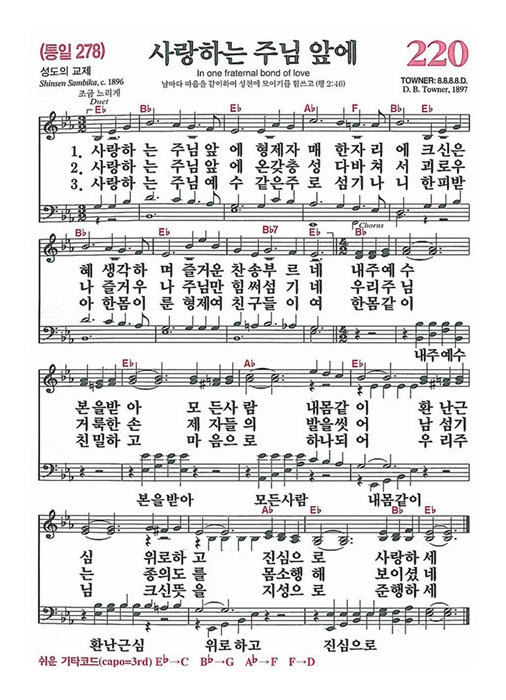

# 099 12-7 예수님의 참 가족



> * 마태복음 12:46 예수께서 무리에게 말씀하실 때에 그 모친과 동생들이 예수께 말하려고 밖에 섰더니
> * 12:47 한 사람이 예수께 여짜오되 보소서 당신의 모친과 동생들이 당신께 말하려고 밖에 섰나이다 하니
> * 12:48 말하던 사람에게 대답하여 가라사대 누가 내 모친이며 내 동생들이냐 하시고
> * 12:49 손을 내밀어 제자들을 가리켜 가라사대 나의 모친과 나의 동생들을 보라
> * 12:50 누구든지 하늘에 계신 내 아버지의 뜻대로 하는 자가 내 형제요 자매요 모친이니라 하시더라

 

가장 이해받고 사랑받아야 할 사람에게 배척을 당하고 오해를 받을 때처럼 괴로운 때가 없습니다. 차라리 모르는 사람에게나 반대파에게 반대를 당한다면, 덜 상처를 받을 것입니다. 예수님은 바리새인들과 서기관들에게 의해서 심각한 오해와 비판을 받았습니다. 그것이 12장에서 나타난 이야기의 대부분입니다.

그런데 오늘 성경본문에는 이러한 바리새인과 서기관들이나 예수를 반대하는 사람에게 의해서가 아니라, 그의 육신의 어머니와 그의 형제들로부터 오해를 받고 불신을 받고 있다고 하는 사실을 오늘 성경에서 발견하게 됩니다. 46절을 우리 같이 보시겠습니다. 예수께서 무리에게 말씀하실 때 그 모친과 동생들이 예수께 말하려고 밖에 섰더니

> * 마태복음 12:46 예수께서 무리에게 말씀하실 때에 그 모친과 동생들이 예수께 말하려고 밖에 섰더니

 

여기서 우리들은 예수님의 모친과 형제들이 예수님을 이해하고 격려하기 위하여 찾아온 것이 아니라는 사실을 앞뒤 문맥에서 분명하게 알 수가 있습니다. 예수님의 사역을 격려하기 위해서가 아니라, 지금 예수님의 사역을 막기 위해서 찾아온 것입니다.

그 내용은, 그 전에 마가복음 3장 20절과 21절에 보면 좀 더 뚜렷합니다. 마가복음 3장 20절과 21절에 보면은, 집에 들어가시니 무리가 다시 모이므로 식사할 겨를이 없는지라 예수의 친족들이 붙들러 나오니 이는 그가 미쳤다 함이라. 이렇게 돼 있습니다. 그리고 나서 마가복음 3장, 좀 더 나가면은 똑같은 내용의 본문이 나타납니다.&#x20;

> * 마가복음 3:20 집에 들어가시니 무리가 다시 모이므로 식사할 겨를도 없는지라
> * 3:21 예수의 친속들이 듣고 붙들러 나오니 이는 그가 미쳤다 함일러라

 

예수님께서 식사할 겨를조차 없었습니다. 그래서 아마 끼니를 거르신 것 같습니다. 또 제때 식사를 못 하신 것 같습니다. 그리고 예수님께서 지금 활동하시는 모든 활동이 정상적인 사람의 눈에 볼 때는 조금 이상한, 너무 좀 이상한 그런 모습으로 비춰졌는지도 모릅니다. 그래서 예수님의 친척들이 예수님에게 왔는데, 예수님을 좀 붙들어 가시기 위하여, 그만 일하시라고 붙들어 가시기 위하여 왔다고 말했습니다. 그 이유는 예수가 미쳤다 함이라 하는 이야기입니다.

예수님의 가족들에 의하면 예수님은 일부 세상 사람들이 생각하는 대로 미친 사람으로 오해를 한 것입니다. 다른 사람이 아니라 가족들이 그렇게 생각을 했습니다. 식사를 거르면서까지도 무리하게 고된 사역을 하고 있다든지, 끊임없이 바리새인들과 서기관들과 충돌을 하고 있다든지, 그리고 알 수 없는 보통 사람으로서는 할 수 없는 기적을 베풀고 있다든지, 하는 소문들이 이 가족들에게 들려왔기 때문입니다. 이걸 보면 가족들과 예수님은 같이 사신 것이 아닌 것이 분명합니다. 그렇기 때문에 특별히 마리아 어머니는 인간적으로 예수를 사랑하기 때문에, 그러한 미쳤다는 소문이 나 있는 예수에게 찾아와서 그를 즉각 행동을 중지시키고 잡으러 온 것입니다.

사실 예수님 살아계시는 동안에는 그 가족들이 예수를 제일 이해하지 못했습니다. 그러나 성경에 보면, 예수님의 가족들은 예수께서 십자가에 못 박혀 죽으시고 3일 만에 다시 부활할 때까지는 불확실하고 불신앙적 태도를 취했는데, 부활하시고 나서부터 예수님의 가족들이 태도가 변하는 것을 성경에 보게 됩니다.

마가복음 3장 31절에 보면은 오늘 본문과 비슷한 내용이 계속해서 나옵니다. 거기에는 이렇게 말했습니다. 때에 예수의 모친과 동생들이 와서 밖에 서서 사람을 보내어 예수를 부르니. 이렇게 돼 있습니다.&#x20;

> * 마가복음 3:31 때에 예수의 모친과 동생들이 와서 밖에 서서 사람을 보내어 예수를 부르니

 

아마 예수님이 말씀을 가르치고 있는 동안에 사람들이 많이 모였기 때문에, 예수님이 있는 곳으로 들어갈 수가 없었습니다. 그래서 사람을 시켜가지고, 네 엄마가 왔다 좀 잠깐 나와라 이렇게 이야기를 한 것 같습니다. 누가복음 8장 19절에도 똑같은 내용의 기사가 있는데, 거기에는 이렇게 되어있습니다. 예수의 모친과 그 동생들이 왔으나 무리를 인하여 가까이 접근하지 못했다 라고 되어있습니다.

> * 누가복음 8:19 예수의 모친과 그 동생들이 왔으나 무리를 인하여 가까이 하지 못하니

 

우리는 이 세 본문, 마태복음과 마가복음과 누가복음에서, 예수님의 그 모친과 여기 앞에 요셉에 대한 얘기가 없는 걸 보면 요셉은 이때 이미 죽은 것 같습니다. 요셉에 대한 얘기가 없고 그 어머니에 관한 얘기가 있고 동생들에 관한 얘기가 있는데, 이 인물들 중에서 특별히 주축이 되는 사람은 어머니입니다. 마리아입니다. 아마 그 동생들은 어머니의 의견에 따라서 같이 동행을 한 것으로 되어 있습니다.

마리아는 어떤 사람입니까? 예수님의 사역 초기에, 특별히 요한복음 2장에 보면, 누구보다도 예수님의 신성을 인정했던 사람입니다. 그것뿐만 아니라 그 자신이 예수를 잉태할 때, 남자를 통해서 잉태하지 아니하고 성령을 통해서 잉태했던 것을 누구보다도 잘 아는 것은 마리아 자신일 것입니다.

그럼에도 불구하고, 지금 이 시점에 와서 예수에 대한 참 인간적인 이해, 신앙적인 이해보다는 인간적인 이해 쪽으로 지금 기울어지고 있다고 하는 점을 여기서 발견하게 됩니다. 이것이 바로 인간적인 갈등과 신앙적인 이해의 차이입니다. 이 부분은 마치 베드로가 예수님을 인간적으로 지극히 사랑하고 충성하였지만, 그러나 그의 충성과 사랑은 신앙적이지 못하고 인간적이었던 것과 똑같은 그런 모습을 여기서 발견하게 됩니다.

사람은 누구든지 이러한 오류를 범하게 되는 것 같습니다. 이런 의미에서 캐톨릭에서 마리아를 넘어 지나치게 숭배하는 것은 잘못된 오류라고 하는 사실을 여기서 우리는 발견하게 됩니다. 그분은 훌륭한 여자입니다. 그러나 신적인 여자는 아닙니다. 누구든지 이런 오류를 인간은 가질 수가 있습니다.

베드로의 경우를 보면은 십자가를 지려는 예수님에게 충성스럽게 그가 이런 고백을 합니다. 주여, 그리 마옵소서. 그것은 인간적으로 보면 충성입니다. 헌신입니다. 그러나 신앙적으로 보면은 그것은 하나님의 일을 막는 일이었습니다. 이때 예수님께서 마태복음 16장 23절에서 베드로에게 이렇게 갑자기 돌변하면서 대답을 합니다. 사탄아 내 뒤로 물러 가라 너는 나를 넘어지게 하는 자로다 네가 하나님의 일을 생각하지 아니하고 도리어 사람의 일을 생각하는도다. 이렇게 예수님께서 말씀하셨습니다.&#x20;

> * 마태복음 16:23 예수께서 돌이키시며 베드로에게 이르시되 사단아 내 뒤로 물러 가라 너는 나를 넘어지게 하는 자로다 네가 하나님의 일을 생각지 아니하고 도리어 사람의 일을 생각하는도다 하시고

 

우리는 여기에서 사탄이 아주 간교하고 교활한 공격을 하고 있는 것을 보게 됩니다. 바리새인들과 서기관들을 통해서 하는 비판과 공격은 쉽게 구분할 수 있습니다. 그것은 힘들고 어렵고 고통스러운 것이지만은, 그러나 그것은 눈에 아주 잘 볼 수 있는 사탄의 공격인 것을 알 수가 있습니다. 그러나 인간적으로 거부하기 어려운 가족이나 충성하는 사람들을 통해서 그 사람을 위해서 하나님의 뜻을 저버리게 하는 공격은 아주 이것은 교활한 사탄의 공격인 것입니다. 사람들은 가끔 이러한 영적인 도전을 받을 때가 있습니다. 그 사람을 위한 것이면서도 궁극적으로는 그 사람을 버리게 하는 수도 있기 때문입니다.

예수님은 이러한 영적인 도전에 대해서 예리하게 판단하시고 다음과 같은 대답을 하셨습니다. 그것이 47절과 48절의 내용입니다. 같이 읽겠습니다. 시작. 한 사람이 예수께 여짜오되 보소서 당신의 모친과 동생들이 당신께 말하려고 밖에 섰나이다 하니. 말하던 사람에게 대답하여 가라사되 누가 내 모친이며 내 동생이냐 하시고. 손을 내밀어 제자들을 가리켜 가라사대 나의 모친과 나의 동생을 보라. 이렇게 돼 있습니다.

> * 마태복음 12:47 한 사람이 예수께 여짜오되 보소서 당신의 모친과 동생들이 당신께 말하려고 밖에 섰나이다 하니
> * 12:48 말하던 사람에게 대답하여 가라사대 누가 내 모친이며 내 동생들이냐 하시고
> * 12:49 손을 내밀어 제자들을 가리켜 가라사대 나의 모친과 나의 동생들을 보라

 

예수님께서 자기 지금 어머니가 와 있고 동생이 와 있습니다. 그리고 지금 자기를 찾고 있습니다. 예수님, 당신의 어머님이 지금 오셨습니다. 이때 예수님이 갑자기 태도를 바꾸셨습니다. 누가 나의 모친이며 나의 형제냐. 그러시면서, 오히려 제자들을 향하여 그들을 가리키면서 너희들이 나의 모친이고 나의 형제다. 참 인간적으로는 이해하기 어려운 지금 말씀을 하십니다.

그리고 아주 중요한 말씀을 50절에서 하고 계십니다. 예 아주 중요한 말입니다. 이 50절의 말씀은 바로 예수님의 가족, 천국 가족, 하나님 나라의 가족이 어떤 사람이냐? 누구냐? 하는 것을 예수님이 정의해 주시는 그런 부분입니다. 같이 읽겠습니다. 누구든지 하늘에 계신 내 아버지의 뜻대로 하는 자가 내 형제요 자매요 모친이니라 하시더라

> * 마태복음 12:50 누구든지 하늘에 계신 내 아버지의 뜻대로 하는 자가 내 형제요 자매요 모친이니라 하시더라

 

우리가 여기서 조심할 것이 있습니다. 예수님께서 이 부분에 있어서 가정이나 식구나 어머니를 무시했거나, 미워했거나, 배척했다고 하는 것이 아니라는 사실을 우리는 먼저 이해해야 합니다. 누구보다도 예수님은 어머니를 사랑했습니다. 누구보다도 예수님은 가족을 사랑했습니다. 디모데서에 있는 말씀처럼 가족을 배신하는 자는 불신자보다 더 악하다고 성경이 말하고 있습니다.&#x20;

> * 디모데전서 5:8 누구든지 자기 친족 특히 자기 가족을 돌아보지 아니하면 믿음을 배반한 자요 불신자보다 더 악한 자니라

 

가족 전도 하지 않은 사람은 이건 불신자보다 더 악한 겁니다. 우리는 가족을 사랑해야 하며, 친척을 사랑해야 하며, 성경의 정신 가운데 또 하나의 중요한 정신은 부모에게 공경하는 것입니다.

예수님은 여기에서 말하고 있는 부분이 가족을 무시했거나 친척을 무시했거나 부모님을 무시했다고 하는 뜻이 아닙니다. 그 대표적인 또 하나의 예는 우리 예수님께서 십자가에 못 박혀 돌아가실 바로 그 즈음에, 그 십자가 상에서, 피 흘리시면서 사랑하는 제자들에게 자기 어머니를 부탁한 점입니다. 보소서 당신의 어머니입니다. 보소서 당신의 아들입니다. 그리고 자기가 십자가 못 박혀 죽으면서, 예수님은 자기 사랑하는 제자들에게 내 육신의 어머니를 좀 대신 봐달라고, 평생 좀 어머니처럼 모셔 달라고 이렇게 부탁한 걸 보면 결코 예수님은 어머니를 무시했거나 효도하지 않은 것이 절대 아닌 것을 여기서 우리는 읽을 수가 있습니다.

> * 요한복음 19:26 예수께서 그 모친과 사랑하시는 제자가 곁에 섰는 것을 보시고 그 모친께 말씀하시되 여자여 보소서 아들이니이다 하시고
> * 19:27 또 그 제자에게 이르시되 보라 네 어머니라 하신대 그 때부터 그 제자가 자기 집에 모시니라

 

그러면 무엇입니까? 그러면 예수님께서 누가 모친이며 누가 내 형제냐 라고 말씀하신 그 뜻은 무엇입니까? 여기에 아주 중요한 뜻이 한 3가지가 있습니다.&#x20;

 

첫째는, 천국 가족이라고 하는 것은, 하나님의 나라에 가족이라고 하는 것은, 인간관계에서 세워질 수 없다는 진리입니다.

이 세상의 나라는 모든 것이 바로 이러한 인간관계에서 시작이 됩니다. 혈연이라든지, 지연이라든지, 학연, 동문 같은 것을 통해서 사회가 형성이 됩니다. 색깔이 까맣다든지, 하얗다든지, 아니면 노랗다든지, 이런 것으로 인간 사회는 관계가 구성이 됩니다. 아무리 이념이 강한 집단이라 할지라도 이러한 인간관계의 줄은 피할 길이 없습니다.

최근에 몰락한 필리핀의 경우는 말할 것도 없거니와, 루마니아의 차오세스크, 그리고 이북의 김일성 등의 모든 구조는 가족 권력 구조입니다. 그들이 가족을 동원시키지 않았더라면 이렇게까지 사태가 심각하지 않았을 것입니다. 그러나 권력을 잡고 보니까 자기의 부인, 아들, 많은 일가 친척 식구들을 자기의 권력 구조로 끌어들인 것을 봅니다. 이것이 바로 인간 사회가 필연적으로 가질 수밖에 없는 구조인 것입니다. 그것이 세상의 구조의 특징입니다.

또 어떤 정치 권력 구조를 보면 경상도 사람들끼리 모이는 구조가 있습니다. 요즘은 또 호남사람끼리 모일려고 하는 그런 구조들이 있습니다. 이것을 비슷하게 흉내 낸 교회도 있습니다. 이북 사람들이 모인 교회, 경상도 사람들이 모인 교회, 호남 사람들이 모인 교회. 이렇게 사람들이라고 하는 것은 자기들 끼리끼리 동류결합 원칙에 의해서 모이는 것이 세상의 모든 사회 구조인 것입니다.

또 그런 것이 아니라면, 어느 학교 출신 동문이냐 하는 것들이 인간관계에 있어서 피치 못할 것입니다. 선배냐 후배냐 몇기냐 이러는 것들입니다. 그래서 가능하면은 손이 안으로 굽는 식으로 자기들끼리끼리, 이렇게 이렇게, 그 사회 권력 구조와 이념 집단을 형성해가는 것입니다. 이러한 이해관계와 전혀 상관이 없다고 하는 이념 집단에도 우리는 김일성이나 차오세스크 통일을 통해서 우리는 이런 것들을 많이 현실적으로 보는 것입니다. 그것이 바로 세상 집단입니다.

 

그러나 천국은 절대로 이러한 인간관계로 인해서 맺어지는 구조가 아니라는 것을 오늘 예수님이 여기서 지금 보여주고 있는 것입니다. 예수님은 마태복음 10장 36절에서 우리가 지난번에 공부를 했습니다마는, 사람의 원수가 자기 집안 식구리라. 이렇게까지 말씀하셨습니다.

> * 마태복음 10:36 사람의 원수가 자기 집안 식구리라

 

이 말씀은 어느 부분에 있어서 진리입니다. 혈연과 지연과 학연이 중요합니다. 그러나 그것은 세상에서 인간관계일 뿐이지 천국에선 이것이 통하지 않습니다.

 

두 번째입니다. 그러면 하나님의 나라의 기초는 어디에 근거를 합니까? 영적인 관계에서 천국 가족이 시작된다고 하는 것입니다. 초대 기독교인들은 다음과 같이 말했다고 합니다. 크리스찬의 유일한 친척은 성도일 뿐이다. 성도들이 우리의 가족이요. 친척이다. 이렇게 말했습니다.

요한복음 7장 5절에서 예수님의 형제에 대해서 이렇게 말했습니다. 이는 그 형제들이라도 예수를 믿지 아니함이어라. 예수님의 형제들이 예수를 믿지 않았습니다. 그렇다고 놀랄 것은 하나도 되지 못합니다. 그것이 바로 혈연의 하나의 한계이기 때문입니다.

> * 요한복음 7:5 이는 그 형제들이라도 예수를 믿지 아니함이러라

 

식구라고 다 복음을 받아들이는 것도 아니며, 식구라고 다 똑같은 뜻을 가질 수 있는 것도 아니라는 것입니다. 사실 가족이라는 것은 가장 가까우면서도 사실 원수와 같은 관계인 것입니다. 여러분, 우리 세상에 형제끼리 싸우고 미워하고 원수된 사람들이 얼마나 많습니까? 혹시 여기 앉아 계신 여러분 가운데서도 형제하고 말하지 않는 사람이 혹시 있는지도 모릅니다. 무슨 이유였든지 간에 집을 발걸음을 뜸하고, 같은 한 배에서 나온 식구들인데 서로 등을 쥐고 칼을 내세우는 이런 사람들이 있을 수가 있는 것입니다. 이것이 인간의 혈연입니다. 이 피라고 하는 것은, 혈연이라고 하는 것은, 어떻게 보면 가장 숭고하면서도 어떻게 보면 가장 참 비참한 것입니다. 그것이 인간관계의 인간 구조입니다.

특별히 인간은 죄를 짓고 나서부터, 성적으로 타락을 해서, 한 남편과 한 아내만 살면 좋겠는데, 또 다른 여자를 놓고 또 다른 남자를 피치 못하게 상황이 그렇게 가질 수가 있게 됩니다. 이런 여러 가지 복잡한 인간관계 구조가 인간의 혈연인 것입니다.

심지어 이런 생각까지 하는 사람이 있습니다. 이 사람이 과연 내 형제인가? 그런 생각을 하는 수가 있습니다. 한 배에서 나왔나? 할 정도로, 의심이 날 정도로, 그렇게 원수된 사람이 있습니다. 어떤 부모는, 과연 이 부모가 날 낳았나? 혹시 이거 날 낳은 부모가 아니지 않나? 이렇게 하는 걸 보면 날 낳은 부모가 아니지 않은가? 하는 생각까지 갖게 하는 그런 부모도 있고, 이 자식이 내 배에서 나왔나? 도저히 믿어지지 않는 자식도 있다는 얘기입니다.

여러분, 그러므로 천국은 이러한 인간관계 구조에 기초하지 않는다고 하는 사실을 우리는 믿어야 합니다. 천국은 영적인 관계에서 가족이 형성이 되며 하나님의 나라가 형성이 됩니다.

 

그러면 영적인 관계, 영적인 기초에서 천국 식구들이 형성된다고 한다면, 그것은 어떻게 되는 것입니까? 예수님께서는 이렇게 한마디로 정의를 했습니다. 하늘에 계신 아버지의 뜻대로 행하는 사람이 곧 하나님 나라의 가족이다.

> * 마태복음 12:50 누구든지 하늘에 계신 내 아버지의 뜻대로 하는 자가 내 형제요 자매요 모친이니라 하시더라

 

피를 나눈 사람이 아니다. 동창이 아니다. 한 지역에서 같이 자랐기 때문에 되는 것이 아니다. 하나님의 가족은 하나님의 뜻을 따라 순종하는 사람이 하나님의 가족이다. 그래서요 착각해서는 안 될 건, 우리 부인이 예수 잘 믿으니까 나는 덤으로 가겠지 생각하는 남편이 없기를 바랍니다. 우리 부모님이 기도하니까 나는 덤으로 가겠지. 상관이 없다는 얘기입니다. 인간 관계의 기초가 곧 천국의 기초가 아니기 때문입니다. 여러분은 여러분의 믿음으로 가야 합니다.

그러면 하나님의 뜻대로 행하는 사람만이 천국의 가족이 된다고 말했는데, 그러니까 부부가 같이, 세상에서도 부부가 같이 살다가 천국까지 같이 가면야 더 이상 좋을 수가 없겠죠. 여러분 분명히 하나 꼭 알아둬야 할게, 세상의 인간관계가 천국의 관계가 아니라는 사실입니다.

 

누가 천국 가정입니까? 요한복음 1장 12절에는, 영접하는 자 곧 그 이름을 믿는 자들에게는 하나님의 자녀가 되는 특권을 주었다고 말했습니다. 예수 그리스도를 영접하고 믿는 사람이 천국 가족입니다. 요한복음 17장 3절에는, 영생은 곧 유일하신 참 하나님과 그의 보내신 자 예수 그리스도를 아는 것이라고 말했습니다. 그러므로, 천국 가정은 예수 그리스도를 영접하고, 예수 그리스도를 믿고, 예수 그리스도를 아는 사람입니다. 천국의 식구들입니다. 요한복음 6장 29절에는 또 놀라운 말씀이 하나 있습니다. 예수 그리스도를 하나님이 보내신 자를 믿는 것이 하나님의 일이다. 이렇게 되있습니다. 우리가 하나님의 일한다. 하나님의 일한다는 말을 하는데, 하나님의 일이란 예수를 믿는 것을 의미한다.&#x20;

> * 요한복음 1:12 영접하는 자 곧 그 이름을 믿는 자들에게는 하나님의 자녀가 되는 권세를 주셨으니
> * 17:3 영생은 곧 유일하신 참 하나님과 그의 보내신 자 예수 그리스도를 아는 것이니이다
> * 6:29 예수께서 대답하여 가라사대 하나님의 보내신 자를 믿는 것이 하나님의 일이니라 하시니

 

예수님의 피로 한 몸을 이루고, 그분의 지체로서 한 가정을 이룬 사람들입니다. 이 사람들이 다 천국 가족들이요. 천국 식구들인 것입니다.

한걸음 더 나아가서, 천국 식구는 입으로만 주여 주여 하는 사람이 아닙니다. 하늘에 계신 내 아버지의 뜻대로 행하는 사람이 천국 가족입니다. 마태복음 7장 21절과 23절, 우리가 산상설교 하면서 다 배웠습니다. 나더러 주여 주여 하는 자마다 천국에 다 들어가는 것이 아니오. 다만 하늘에 계신 내 아버지의 뜻대로 행하는 자라야 들어가리라. 그 날에 많은 사람들이 나더러 이르되 주여 우리가 주의 이름으로 선지자 노릇도 하며 주의 이름으로 귀신을 쫓아내며 주의 이름으로 권능을 행하지 아니하였나이까 하리니. 그때에 내가 저희에게 밝히 말하되 내가 너희를 도무지 알지 못하니 불법을 행하는 자들아 내게서 떠나가라. 이렇게 예수님이 말씀하셨습니다.

> * 마태복음 7:21 나더러 주여 주여 하는 자마다 천국에 다 들어갈 것이 아니요 다만 하늘에 계신 내 아버지의 뜻대로 행하는 자라야 들어가리라
> * 7:22 그 날에 많은 사람이 나더러 이르되 주여 주여 우리가 주의 이름으로 선지자 노릇하며 주의 이름으로 귀신을 쫓아 내며 주의 이름으로 많은 권능을 행치 아니하였나이까 하리니
> * 7:23 그때에 내가 저희에게 밝히 말하되 내가 너희를 도무지 알지 못하니 불법을 행하는 자들아 내게서 떠나가라 하리라

 

여러분 교회 들락날락하고, 찬송가 부르고, 기도 하고, 주여 주여 한다고 내 자식들이 아니라는 말입니다. 내 아버지의 뜻대로 살고, 행동하고, 내 아버지의 뜻대로 믿는 사람이 바로 천국 가족이다. 예수님께서 이렇게 말씀을 하셨습니다.

오해하지 마십시오. 교회 단순히 왔다 갔다고 해서 천국이 보장되는 것이 아닙니다. 진실로, 내 마음속으로, 내 삶을 통해서, 하나님을 인정하고 예수 그리스도를 내가 믿고 그 뜻대로 사는 사람만이 하나님과 연계된 가족이라고 하는 것입니다. 천국 가족, 이 사람이 천국가족 입니다. 그 사람이 어머니입니다. 그러니까 여러분이 내 어머니 될 수가 있어요. 여러분이 내 형제가 될 수 있어요. 내 누님도 될 수 있고요. 내 친구도 될 수 있어요. 영적인 관계에 기초해서 볼 때 그렇다는 이야기입니다.

 

오늘 이 말씀을 통해서 세 번째로 발견하는 놀라운 진리가 하나 있습니다. 하나님, 그러면 결론이에요. 하나님의 나라의 가족은 결론, 누구냐? 하는 것이 49절에 이렇게 예수님이 말씀하셨습니다. 49절 시작. 손을 내밀어 제자들을 가리켜 가라사대 나의 모친과 나의 동생들을 보라

> * 마태복음 12:49 손을 내밀어 제자들을 가리켜 가라사대 나의 모친과 나의 동생들을 보라

 

예, 예수님께서, 손을 내밀어, 이렇게 제시를 했겠죠. 손을 내밀어 당신이 내 모친이요. 내 형제요 내 동생이다. 이 원문에는 볼지어다 라는 말이 먼저 나옵니다. 감탄사로 시작되는 말이 먼저 나옵니다.

누가 천국 가정입니까? 혈연에 의해서 이루어지는 것이 아니라, 진정한 예수 그리스도의 제자의 삶을 살아가는 데 천국 가정에 뜻이 있습니다. 이것은 놀라운 말씀입니다. 그러나 사실입니다. 이 진리는 영적인 모든 영역에서 다 이루어집니다.

여러분 친구 있죠? 여러분 친구 아마 있을 것입니다. 예수를 믿고 나면 친구의 개념이 변합니다. 옛날에 그렇게 친하던 친구가 가까워지지가 않아요. 피를 나눈 형제도 안 돼요. 진짜 복음을 알고 나면, 잘 들으세요. 참 우정은 영적인 데서 시작됩니다. 영적으로 맺어진 우정, 그것은 설명할 수 없이 깊고 오묘한 것입니다.

여기 결혼하신 분들이 많이 계십니다. 진정한 결혼은 영적으로 맺어진 부부입니다. 그래서 이런 부 부들 있죠? 한사람을 위해서 잘 믿고, 한사람은 안 믿으면요, 참 갈등이 많습니다. 왜? 영적으로 일치감이 없기 때문에. 그 육신과 육신이 만나서 잠자는 게 무슨 의미가 있어요? 애기 낳고 사는 게 도대체 뭐예요? 허무하기 짝이 없는 거에요. 썩어질 육신, 무덤에 갈 육신, 그 명예, 돈, 집, 다 이게 무슨 의미가 있는 거예요? 나이가 들수록 허무해지는 겁니다.

진정한 결혼은 영적인 가족의 기초에서 만들어진 부부입니다. 진정한 우정은 영적인 관계에서 기초한 형제와 자매일 때, 이것은 지상에서뿐만 아니라 천국에까지 가는 것입니다. 이것이 진정한 가족 입니다.

이것뿐만 아닙니다. 영적인 것으로 기초가 된 학문, 다르습니다. 영적으로 기초가 된 문학, 음악, 미술, 모든 다양한 예술의 세계에 있어서도 근본적으로 달라요. 성령 충만한 사람이 부르는 노래와 성령이 없는 사람이 부른 노래는 전혀 다르습니다. 악기 연주도 다르습니다. 미술도 다르습니다. 문학 작품 쓰는 것도 다르습니다. 기초가 다르기 때문입니다. 이것이 새로운 세계입니다. 영적으로 맺어진 것은 무엇이든지, 어떤 것이든지, 그것은 세상 것과 바꿀 수 없는 높은 가치가 있는 것입니다.

이 말은 여러분의 조심하게 들을게 또 하나 있어요. 이렇게 영적인 가정은 중요하기 때문에요. 영적인 가족끼리 상처받으면 상처가 보통 큰 게 아닙니다. 그래서 예수 믿는 사람들은 조심해야 됩니다. 믿는 사람끼리 한번 상처받으면 그 상처가 깊습니다. 왜냐하면, 이것이 영적으로 생겨진 일이기 때문입니다.

제가 이번에 여러분들이 기도해 주신 덕분으로 은혜 가운데 무사히 건강 진단을 하는 여행을 잘 마치고 돌아왔습니다. 제가 이번에 여행에서, 여러 가지 참 간증할 일들이 참 많이 있는데, 떠날 때부터 돌아올 때까지 제가 곰곰히 생각, 이 말씀을 준비하면서 생각해 보니까, 만난 사람들은 다 예수쟁이들이에요. 그게 내가 왜 이렇게 됐나. 그런데 어디를 가나, 예를 들면 제가 갔던 병원에 로체스터의 한국인 열 가정이 사는데, 난생 처음 보는 그 장로님 의사분이 절 공항에 와서 마중 나와주고, 자기 집의 저녁을 대접해 주고, 그 모든 가정을 그냥 그렇게 친절하게 잘 해 줄 수가 없어요. 제가 언제 봤다구요. 그 사람 내 형제면 그렇게 하겠어요? 시간을 내서 돈 써가면서. 어느 호텔에 가면 누가 모르게 다 돈을 다 지불해 준 사람이 있고, 그 열 가정이 모이는 로체스터에 간 제가, 본 일이 언제 있어요. 크리스마스 예배를 같이 참여를 했는데, 그저 자기 집에 그냥 모셔가서 식사를 안 한다고 그냥 그게 화예요. 제가 언제 봤다고. 그런 일이 어떻게 생길 수가 있겠습니까? 그날 처음 본 거예요. 그런데 우리는 한 가족 같았고 한 식구 같았고, 내 형님 같았고, 내 동생 같았고, 내 부모님 같은 그런 걸 느꼈어요.

근데 그게, 가는 데마다, 어딜 가나. 제가 물론 아는 사람 만나는 건 너무나 당연한 일이지요. 예를 들면 오성현 집사님 만나서 참 참 놀랍게 재미있게 참 서로 교제했다. 이건 당연한 일이지만 전혀 알지 못하는 사람이에요. 그저 20년, 그냥 그저 뭐 죽었다 살아난 사람 만난 것 같이 좋아하고, 여러분 이게 무슨 비밀입니까? 제가 느낀 게 하나있어요. 달나라 가도 우리는 외롭지 않다. 지구 어느 곳으로 가든지 크리스천은 외롭지 않다. 예수 이름 하나 때문에. 우리가 서로 언제 봤다고요. 이렇게 친할 수가 있겠습니까? 이것이 천국 가족입니다.

그리고 옛날에 만났던 관계가 아닙니다. 옛날에 친했던 관계라 할지라도, 이번에 제가 뉴욕을 갔더니, 이동원 목사님 비행기 타고 오시고, 김남수 목사님이 오시고, 홍정길, 제가 왔다고 말이죠. 그렇게 뭐하러 왔냐? 그래서 내 얼굴 보러 왔대요. 좀 아프다니까 걱정스러워서. 제가 가만있어보니까, 이게 웬 사랑인가? 웬 은혜인가? 이게 누구 때문인가? 여러분, 예수님 때문입니다.

우리는 형제요 자매입니다. 여기 계신 분들은 혈연으로도 설명할 수 없는, 지연으로도 설명할 수 없는, 학연으로도 설명할 수 없는, 그리스도 안에서 다 형님이요. 누님이요. 아버지요. 동생입니다.

 

오늘 예수님이 우리에게 가르쳐주신 진리가 여기 있습니다. 누가 내 모친이며? 누가 내 형제냐? 그게 아니다. 내 아버지의 뜻대로 살고자 하는 사람이 다 우리의 형제요. 자매요. 우리의 가족이다. 사랑하는 성도 여러분, 교회 나오는 사람 중에서 제일 불행한 사람은 왔다 가는 사람입니다. 물론 등록도 않고 살짝 왔다 살짝 가는 사람, 말씀만 듣고 가는 사람, 제일 불행한 사람이라고 나는 말씀드리고 싶습니다. 말씀 듣는 축복도 중요하지만, 천국 가정의 교제권을 잃어버린 사람, 불행한 사람입니다. 세상에 어디 가서 위로받습니까? 여러분 여러분 구역에 꼭 가십시오.

어떤 분들은, 뭐 다 그렇다는 것이 아니라, 우리 교회 구역들 가운데 몇 구역은, 교회는 안 나와도 구역은 꼭 가는 사람들 있습니다. 구역이 그렇게 좋대요. 아니 세상에서 이런 모임을 내가 어디서 봤냐 이거예요. 언제 봤길래 서로 위해 기도해 주고, 언제 봤길래 서로 염려해 주고, 언제 봤길래 서로 이렇게 사랑하느냐. 이말이에요. 밤 12시가 돼도 우리는 헤어질 수가 없다. 그게 그게 천국 가족이기 때문에 그런 것입니다. 일대일 성경 공부 그래서 중요한 것입니다.

여러분, 우리는 천국을 누리며 사는 사람들입니다. 외롭지 않은 사람들입니다. 우리는 절대로 외롭지 않은 사람입니다. 찬송가 278장 가운데, 이거 찬송 하나 부르고 오늘 제 설교를 마치겠습니다.&#x20;

찬송가 278장 가운데, 사랑하는 주님 앞에 형제자매 한 자리에 크신 은혜 생각하여 즐거운 찬송 부르네. 2절. 사랑하는 주님 앞에 온갖 충성 다 바쳐서 괴로우나 즐거우나 주님만 힘써 섬기네. 3절이 중요합니다. 사랑하는 주님 예수 같은 주로 섬기나니 한 피 받아 한 몸 이룬 형제여 친구들이여. 이렇게 돼 있습니다.

1절과 3절을 우리 오늘 말씀을 생각하면서 같이 부르십시다. 3절 부르기 전에 우리 옆에 둘 또는 셋이 이렇게 손을 잡아 보십시오. 가사는 제가 불러드리겠습니다. 서로 얼굴을 보면서, 사랑하는 주님 예수 다시 다시 부르겠습니다. 서로들 좀 같이 손을 잡고 부르십시오.

사랑하는 주님 예수 같은 주로 섬기나니 한피 받아 한 몸 이룬 형제여 친구들이여 한 몸같이 친밀하고 마음으로 하나 되어 우리 주님 크신 뜻을 지성으로 준행하세.

 

<figure><figcaption></figcaption></figure>

사랑하는 온누리 교회 성도 여러분, 여러분은 옆에 계신 분이 천국 가족인 것을 믿습니까? 더 이상 혼자 외롭게 살지 않기를 부탁합니다. 굴을 파고 그 속에서 혼자 외롭게 지내고 고독하게 지내지 마십시오. 우리는 다 주님 안에서 형제요 자매입니다. 오늘 여러분들 마음속에 이런 놀라운 은혜가 넘치기를 바랍니다.

우리는 한 목적, 한 방향, 한 꿈을 가지고 사는 사람입니다. 주님이 우리에게 맡겨주신 지상 명령을 성취하기 위하여 모인 사람들입니다. 서로 예수님처럼, 그러기에 사랑하십시오. 형제가 실수 했거든. 동생이 그럴 수 있다고 생각하십시오. 아 형님이 좀 잘못했다고 생각하십시오. 너무 비판하지 마세요. 너무 욕하지 마십시오. 너무 의심하지 마십시오. 우리는 식구입니다. 형제입니다. 그리스도 안의 소리는 한피 받아 한 몸 이룬 사람들 입니다.

 

기도하겠습니다.

하나님 아버지, 너무나 우리는 외롭게 방어하면서 살아왔습니다. 주님, 이제는 예수님을 중심으로 우리가 한 가족임을 믿게 하여 주시옵시고, 천국의 영적인 질서 속에 기쁘게 살아가게 하여 주시옵소서. 예수님 이름으로 기도 드리옵나이다. 아멘.
